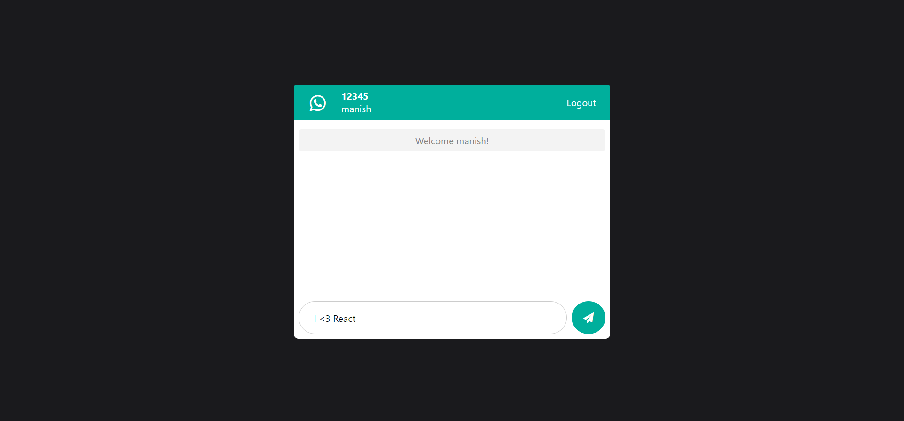
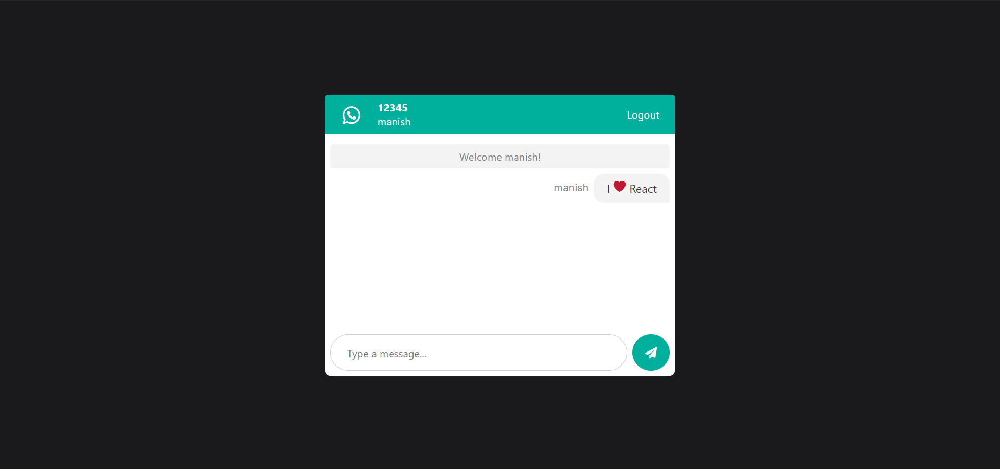

# Whazzuuup: Chat Application

## A chatting application made with ReactJs and NodeJs 

Since I wanted to learn about WebSockets in React and Node, 
I Went thorugh the socket.io documentation: https://socket.io/docs/v3 & 
this awesome tutorial on YouTube: https://www.youtube.com/watch?v=ZwFA3YMfkoc&t=6389s & 
made myself this beautiful application.

## Dependencies Used

### Backend
cors 
socket.io 

### Frontend
socket.io-client 
react-emoji 
react-scroll-to-bottom 
query-string 

## Try It Yourself
https://whazzuuup.netlify.app/

## Screen Shots

### Create a Chat Room

    

### First User

    

### Second User

    

### Second User Leaves

    

### What's a chat app without emoji's? - 1

    

### What's a chat app without emoji's? - 2

    

### Too many messages? - Scroll To Bottom on a click

    

## To run this app..

### Run 'cd your-app-root-directory' for both 'FrontEnd/project' and 'BackEnd' directories

Navigate to the root folder where you copied the code.

### Run 'npm install' in both 'FrontEnd/project' and 'BackEnd' directories

Installs all the dependencies.

### Add

1) Your own "Font Awesome CDN" in FrontEnd/project/public/index.html at the end
2) Your own "Hosted Server URL" in FrontEnd/project/src/components/Chat/Chat.js or just uncomment the next line to run on localhost:5000

### Run 'npm start'

Runs the app in the development mode. 
Open [http://localhost:3000](http://localhost:3000) to view it in the browser.

